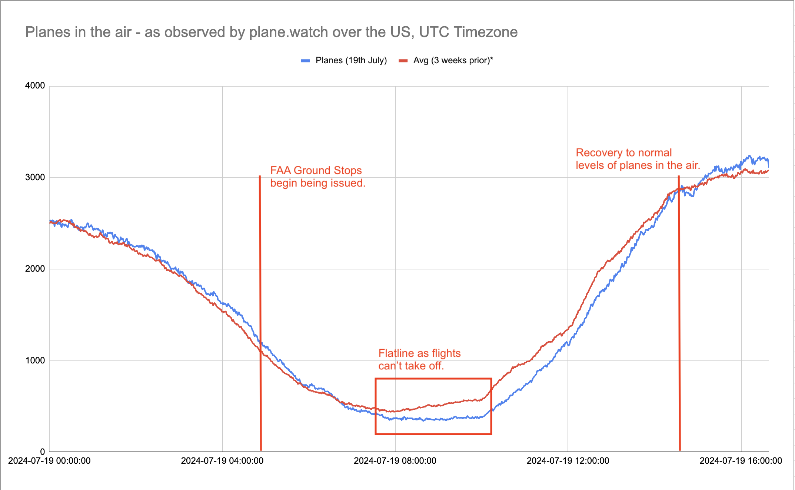

## What Happened ##
At 04:09 UTC on Friday the 19th of July, [Crowdstrike](https://www.crowdstrike.com), a cyber security software producer, released a problematic signature update to it's endpoint protection client. This caused Microsoft Windows systems running the Crowdstrike agent to randomly blue-screen (BSOD) and go offline. Crowdstrike has the majority market-share among a wide variety of  large enterprises including airports, airlines, hospitals, supermarkets and media companies. 

In [Australia](https://www.9news.com.au/national/microsoft-crowdstrike-outage-aussies-stranded-as-global-outage-shuts-down-flights-airports/ffec5ca0-3a28-47cf-87e9-dd6020cf6cda), Sydney and Melbourne airports were affected as well as Virgin Airlines and the Qantas subsidiary Jetstar. Various other airlines in [Japan](https://english.kyodonews.net/news/2024/07/de26206afbdb-japanese-airline-theme-park-railway-firms-hit-in-global-tech-outage.html), [Malaysia](https://www.malaymail.com/news/malaysia/2024/07/19/malaysia-airports-services-malaysia-airlines-unaffected-by-global-it-outage-airasia-flights-running-but-in-house-system-offline/144295) and and [India](https://www.outlookindia.com/national/microsoft-outage-handwritten-boarding-passes-for-passengers-amid-server-issues-at-airports) were also affected causing  major delays for travellers heading home for the weekend, with some airlines resorting to issuing hand-written boarding passes!

As delays were created in various parts of the world, the US Federal Aviation Authority (FAA) issued [Ground Stop Advisories](https://www.fly.faa.gov/adv/adv_list.jsp?WhichAdvisories=ATCSCC&AdvisoryCategory=All&dates=Friday%2C+07-19-2024&Gstop=Gstop) for AAL, UAL, DAL, AAY and NKS airlines starting from approximately 05:45 UTC. The cited reason identified "communications system issues" which were critical enough to warrant the drastic action. This meant that aircraft already in the air could continue their journey however this did halt take-offs, stranding passengers and causing massive delays across the country.

At [plane.watch](https://app.plane.watch), we've queried our database history and put together a graph that highlights exactly how this impacted the number of planes airborne over the US during the day. Plane.watch has more than 300 ADSB feeders based in the US that feed us data about planes within their coverage including position, altitude, heading, type and operator.

 This is a graph of the number of planes seen by plane.watch over continental US on the 19th of July UTC, versus the same day of the three prior weeks, excluding the 5th of July - this was removed from the average due to unusual travel patterns around the 4th of July holiday.

## Analysis ##
As the Ground Stop orders were issued early in the morning, the daily trend was already on the way down. By 06:00 UTC the rate of airborne planes was below the previous average.

You can see a distinct flat-line between 08:00-10:00 UTC where take-offs were not occuring. Following the resumption of take-offs, from ~10:00 UTC there is a strong recovery with normal levels being achieved by 14:30 UTC as delayed flights finally took off. 

Following this we can also see increased numbers of airbone aircraft above the average as airlines attempt to get stranded passengers on their way.

## Join Us ##
Interested in contributing to [plane.watch](https://app.plane.watch)? Want to find out more? head over to our [Discord Server](https://discord.gg/UCM3kn5yDc) and say hi! 