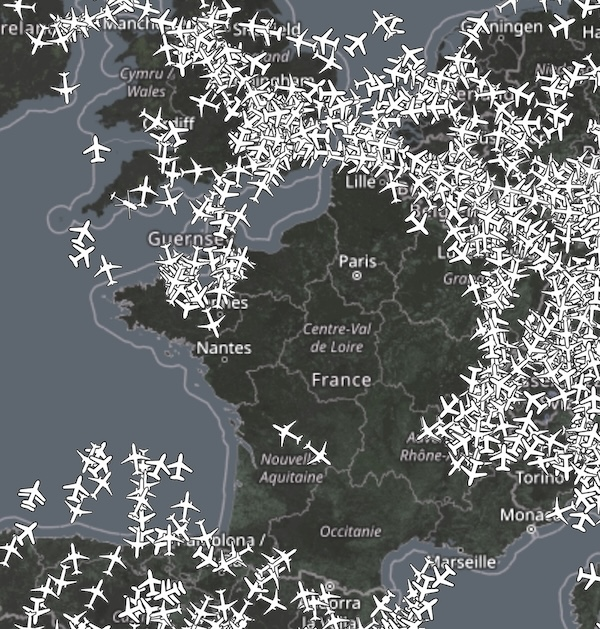

## Paris No-Fly-Zone ##

On  the 26th of July during the 2024 Paris Olympics Opening Ceremony, there was a [148km-radius (80 nautical mile) No-Fly-Zone](https://crisis24.garda.com/alerts/2024/07/france-aviation-authorities-to-impose-no-fly-zone-over-paris-and-northern-france-july-26#:~:text=The%20zone%20will%20extend%20148,and%20Paris%20Beauvais%20(BVA).) covering multiple Parisian airports. During the 6 hours period of 18:30 to 23:59 local time, no commercial or private aircraft were permitted within the region which included Paris Charles de Gaulle (CDG), Paris Orly (ORY), Paris-Le Bourget (LBG), and Paris Beauvais (BVA) airports. 

https://plane.watch has coverage of most of Europe and captured the massive hole drawn on what is usually a very busy airspace.

The No-Fly-Zone was originally announced at the end of 2023 with the [French Civil Aviation Authority (DGAC)](https://www.ecologie.gouv.fr/en/french-civil-aviation-authority-dgac) giving airlines ample time to arrange alternative schedules for the NFZ period. 